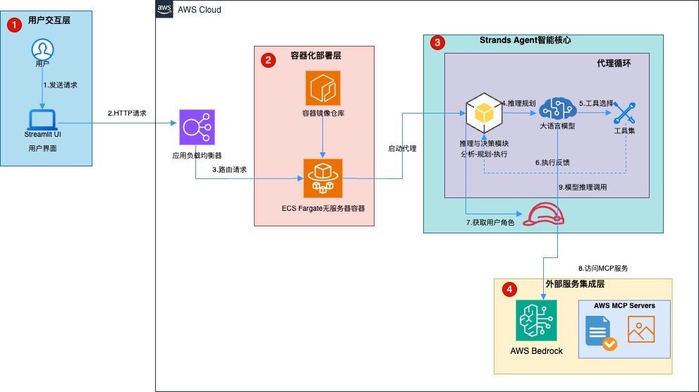
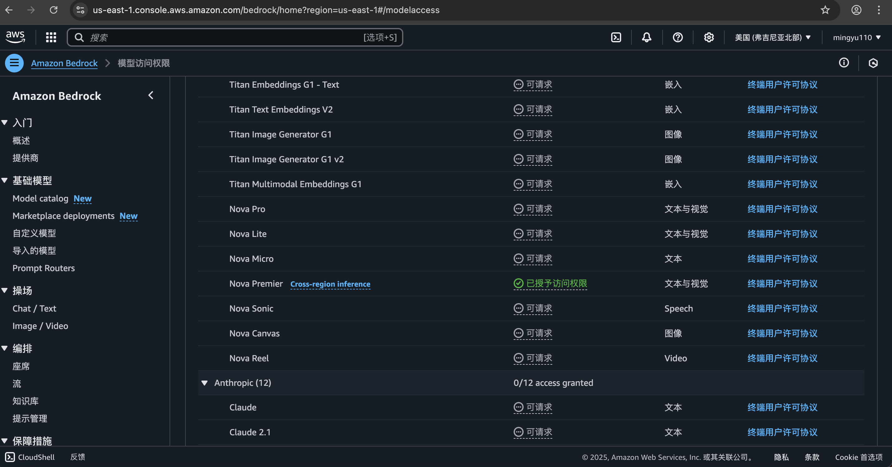

# AI相关的方案及实践

## 项目列表

1. **PDF转Markdown工具** - 使用模型将PDF文件转换为Markdown格式
2. **EV Analyzer AI Agent 20250414** - 基于 CrewAI多智能体开发框架和DeepSeek大模型的新能源行业智能分析助手
3. **AI零代码智能数据分析决策助手.yml** - 零代码 BI 分析与决策助手的 Dify 工作流 DSL 文件
4. **KuberAI** - 基于Spring AI Alibaba和通义千问大模型的Kubernetes资源智能优化系统
5. **推荐系统Neo优化** - 基于AWS SageMaker Neo的推荐系统模型优化与部署实践，通过模型剪枝、微调和编译优化提高推理性能
6. **AWS 云工程师智能助手** - 使用 Strands Agents SDK 构建智能 AWS 云工程师Agent

# AWS 云工程师智能助手

这个项目展示了一个使用 [Strands Agents SDK](https://strandsagents.com/0.1.x/) 构建的强大的 AWS 云工程师智能助手，展示了如何使用模型优先的方法轻松创建复杂的 AI 代理。该助手可以在 AWS 账户上执行各种云工程任务，如资源监控、安全分析、成本优化等。

## 功能特点

### 核心能力
- **AWS 资源管理**：监控、分析和管理多个服务中的 AWS 资源
- **安全分析**：识别安全漏洞并推荐最佳实践
- **成本优化**：发现成本节约机会并推荐资源优化
- **基础设施图表生成**：根据文本描述生成 AWS 架构图
- **AWS 文档搜索**：为任何服务或功能查找相关的 AWS 文档
- **直接 AWS API 访问**：通过代理界面执行 AWS CLI 命令

### 预定义任务
- EC2 实例状态监控
- S3 存储桶分析和管理
- CloudWatch 告警状态检查
- IAM 用户活动跟踪
- 安全组漏洞分析
- 成本优化建议
- Lambda 函数管理
- RDS 实例监控
- VPC 配置分析
- EBS 卷优化
- AWS 架构图生成

### 技术特性
- **Strands Agents SDK 集成**：利用 Strands 框架的代理能力，采用模型优先的方法
- **AWS Bedrock 集成**：使用 Amazon Nova Premier 模型（`us.amazon.nova-premier-v1`）提供 AI 能力
- **MCP 工具集成**：整合 AWS 文档和 AWS 图表 MCP 工具
- **AWS CLI 集成**：通过 `use_aws` 工具直接访问 AWS API
- **Streamlit UI**：用户友好的交互界面
- **容器化部署**：基于 Docker 的部署方案，提高可移植性
- **CDK 基础设施**：使用 AWS CDK TypeScript 的基础设施即代码

## 架构

解决方案包括：

1. **Strands 代理**：使用 Strands Agents SDK 和 AWS Bedrock Amazon Nova Premier 模型（`us.amazon.nova-premier-v1`）构建，实现代理循环架构
2. **Streamlit UI**：用户友好的交互界面
3. **AWS 基础设施**：使用 CDK 部署：
   - ECR 仓库存储 Docker 镜像
   - ECS Fargate 服务运行代理
   - 应用负载均衡器用于流量路由
   - 公共子网配置（无 NAT 网关）
   - 使用 cdk-ecr-deployment 自动化 ECR 部署

### 架构图



## 本地开发

### 前提条件

- Python 3.11+
- 配置了适当权限的 AWS CLI
- Node.js 和 npm（用于 CDK）
- 具有 Amazon Nova Premier 模型权限的 AWS Bedrock 访问权限



### 设置

1. 安装 Python 依赖：
   ```
   pip install -r requirements.txt
   ```

2. 本地运行 Streamlit 应用：
   ```
   streamlit run app.py
   ```

### 详细设置文档

更多详细的设置说明请参考：[设置文档](doc/SETUP.md)

### 运行效果


## 应用部署到AWS云环境

### 前提条件

- 已安装并引导 AWS CDK
- 本地安装 Docker
- 启用了 Bedrock 访问权限的 AWS 账户

### 部署到 AWS

1. 导航到 CDK 目录：
   ```
   cd cloud-engineer-agent-cdk
   ```

2. 安装依赖：
   ```
   npm install
   ```

3. 构建 TypeScript 代码：
   ```
   npm run build
   ```

4. 部署堆栈：
   ```
   cdk deploy
   ```

5. 使用 CDK 输出中提供的 URL 访问代理。

## 环境变量

使用以下环境变量：

- `AWS_REGION`：用于 API 调用的 AWS 区域（必须是 Amazon Nova Premier 可用的区域）
- `AWS_ACCESS_KEY_ID`：AWS 访问密钥（用于本地开发）
- `AWS_SECRET_ACCESS_KEY`：AWS 密钥（用于本地开发）

## 安全考虑

- 代理使用最小权限的 IAM 角色
- Bedrock 权限仅限于必要的模型调用操作
- 所有通信使用 HTTPS
- 应用程序不存储敏感信息

## Strands Agents SDK

本项目利用 [Strands Agents SDK](https://strandsagents.com/0.1.x/)，这是一个采用模型优先方法构建 AI 代理的强大框架。主要特点包括：

### 模型优先方法
Strands Agents SDK 使用模型优先的方法，其中 LLM 作为协调者，决定使用哪些工具以及何时使用。这种方法允许创建更灵活和智能的代理，能够适应复杂场景。

### 代理循环架构
SDK 实现了代理循环架构，其中：
1. 代理接收用户请求
2. LLM 分析请求并确定最佳行动方案
3. 代理按照 LLM 的指示执行工具
4. 结果反馈给 LLM 进行进一步分析
5. 该过程重复进行，直到任务完成

这种架构支持复杂推理和多步骤问题解决，无需硬编码工作流程。

### MCP 集成
本项目利用两个模型上下文协议（MCP）服务器：
- **AWS 文档 MCP 服务器**：提供对全面 AWS 文档的访问，使代理能够检索有关 AWS 服务、功能和最佳实践的准确信息。
- **AWS 图表 MCP 服务器**：使代理能够根据文本描述生成可视化的 AWS 架构图。

### 优势
- **简化开发**：使用最少的代码创建强大的代理
- **灵活的工具集成**：轻松添加新工具和功能
- **智能决策**：让 LLM 决定解决问题的最佳方法
- **透明推理**：跟踪代理的思考过程和工具使用情况
- **可扩展框架**：在核心架构之上构建专门的用例
- **内置 MCP**：原生支持模型上下文协议（MCP）服务器，使访问数千个预构建工具成为可能

### 文档
有关 Strands Agents SDK 的更多信息，请访问[官方文档](https://strandsagents.com/0.1.x/)。

