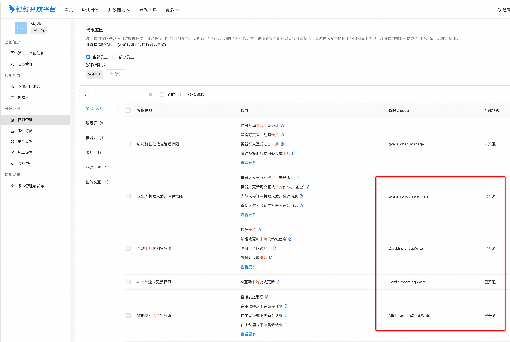
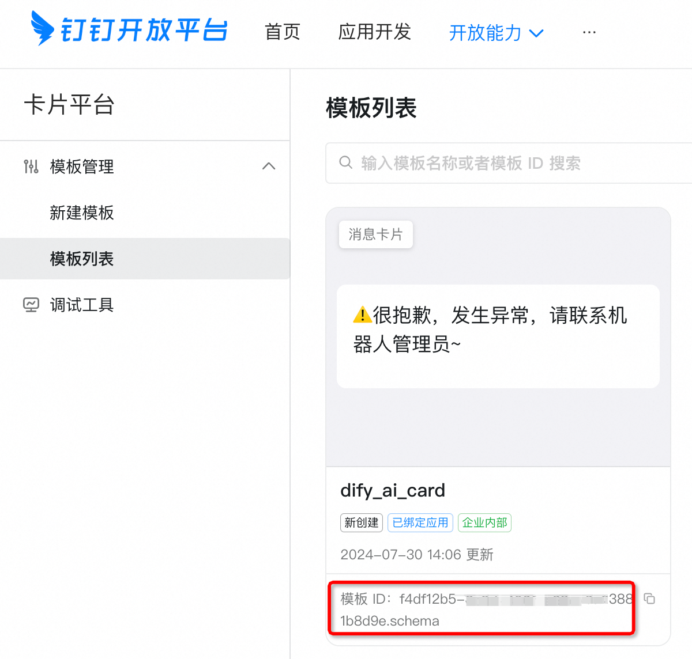
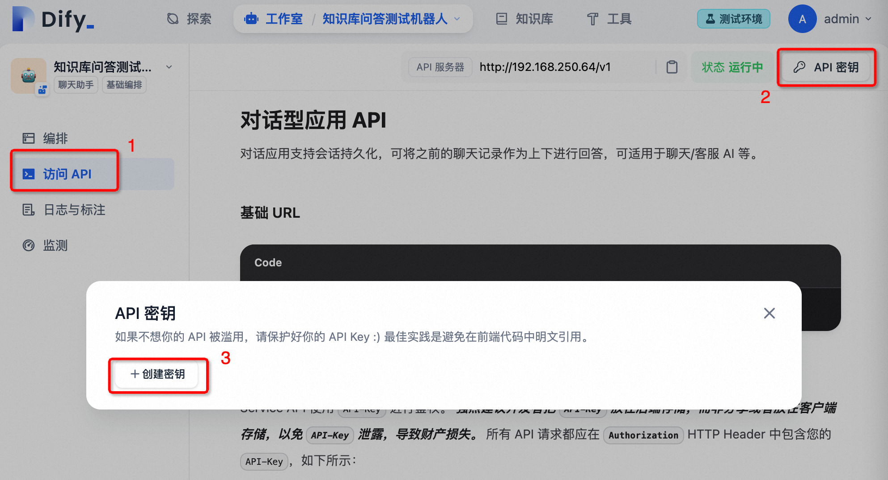
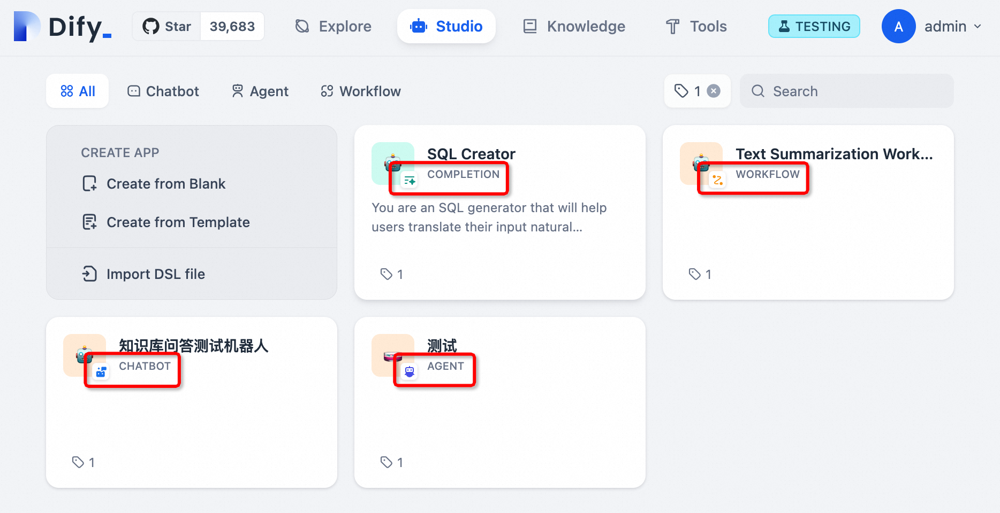

# Dify on Dingtalk项目


## 简介

Dify-on-Dingtalk 是一个轻量级的桥接服务，可将您的 Dify 应用与钉钉机器人无缝集成。它允许您的组织成员直接在钉钉聊天（包括私聊和群聊）中与强大的 AI 应用进行交互，并提供一种原生的、带有流式“打字机”效果的AI响应体验。

## 应用场景与扩展

通过将 Dify 的强大能力接入企业通讯工具，您可以轻松构建和集成各种智能机器人，以提升企业效率和自动化水平。

- **客服机器人**: 集成知识库，提供7x24小时的客户支持，自动解答常见问题。
- **员工助手机器人**: 作为员工的智能助手，提供内部知识查询、流程指引、预订会议室等服务。
- **DevOps助手机器人**: 集成CI/CD工具、监控系统，实现通过聊天指令进行服务部署、状态查询、告警处理等运维操作。
- **HR机器人**: 自动回答员工关于薪酬、福利、假期的疑问，甚至协助完成入职/离职流程。
- **数据分析机器人**: 连接企业内部数据看板或BI系统，允许员工通过自然语言查询业务数据。

也可以参考此项目，构建到其他企业即使通讯工具，例如企业微信、飞书等。

## 功能特性

- [x] **流式AI卡片响应**: 以“打字机”风格提供响应，优化用户体验。
- [x] **Dify应用集成**: 支持 Dify 的聊天机器人、工作流和文本生成应用。
- [x] **对话上下文**: 在私聊和群聊中为每个用户维护独立的对话历史。
- [ ] 即将支持图片输入和输出（引入多模态模型）。

> 本项目已在 Dify 0.6.13 版本上测试通过，应该可以兼容其他 0.6.x 版本。
>
> 后续会测试在Dify V1.X 版本进行验证，因为Dify 在V1.0版本以后进行了大的架构重构。

## 架构概览

本项目作为一个连接钉钉和 Dify 的中间层。它本身不包含任何 AI 逻辑，仅作为一个高效的桥梁。

1.  **配置与启动**: 应用从 `.bots.yaml` 读取机器人配置，并使用 `ThreadPoolExecutor` 为每个机器人启动专用的监听线程。
2.  **钉钉通信**: 它使用基于 WebSocket 的 **钉钉Stream模式SDK** (`dingtalk_stream`) 进行低延迟的实时通信，无需公网IP。
3.  **消息处理**: 异步处理器 (`DifyAiCardBotHandler`) 会立即确认收到的消息以防超时。然后，它向用户发送一个空的 **AI卡片**，并启动一个后台任务来填充内容。
4.  **Dify API交互**: 处理器调用相应的 Dify 应用 API（`chatbot`, `workflow`, 或 `completion`），并设置 `response_mode="streaming"`。它使用 `sseclient-py` 来处理来自 Dify 的服务器发送事件（SSE）流。
5.  **会话管理**: 一个简单的内存缓存将用户的钉钉ID映射到他们的 Dify `conversation_id`，以确保对话上下文得以保持。

## 关键技术

- **钉钉Stream模式SDK (`dingtalk_stream`)**: 与钉钉进行实时 WebSocket 通信的核心组件。
- **钉钉AI卡片 (`AICardReplier`)**: 实现动态、流式“打字机”效果，提供精致用户界面的关键。
- **Dify流式API (`response_mode="streaming"`)**: 产生实时数据流，为交互式响应提供动力。
- **服务器发送事件 (SSE) (`sseclient-py`)**: 用于处理 Dify API 的 SSE 流的客户端实现。
- **异步与多线程 (`asyncio`, `ThreadPoolExecutor`)**: 确保服务响应迅速，并能无阻塞地并发处理多个机器人。
- **配置驱动 (`PyYAML`, `python-dotenv`)**: 无需修改代码即可轻松管理机器人和设置。

## Dify 的角色

在此架构中，Dify 担当 **“AI大脑”** 或 **“后端即服务 (BaaS)”** 的角色。

- **核心智能**: 所有由 AI 驱动的逻辑、内容生成和工作流执行都由您的 Dify 应用处理。
- **多样化的应用支持**: 您可以连接任何在 Dify 上构建的聊天机器人、工作流或文本生成应用。
- **上下文管理**: 本服务依赖 Dify 管理对话历史，通过在每个请求中传递正确的 `conversation_id` 来实现。
- **流式数据源**: Dify 的流式 API 提供了在钉钉客户端创建打字机效果所需的连续数据流。

简而言之，这个项目是一个 **“适配器”**，它将您强大的 Dify 应用引入到钉钉的企业环境中。

## 快速开始

### 1. 准备工作

#### 钉钉设置

1.  **创建企业内部机器人**: 遵循官方指南[创建企业内部应用机器人](https://open.dingtalk.com/document/orgapp/the-creation-and-installation-of-the-application-robot-in-the)。
    -   **关键：将“消息接收模式”设置为“Stream模式”**。
    -   授予机器人发送消息的必要权限。
    -   记录下 **AppID (Client ID)** 和 **AppSecret (Client Secret)**。
    

2.  **创建AI卡片模板**:
    -   进入钉钉开发者后台的[卡片平台](https://open-dev.dingtalk.com/fe/card)。
    -   创建一个新的“消息卡片”模板，选择“AI卡片”作为场景，并将其与您刚刚创建的机器人关联。
    -   记录下 **模板ID**。
    

#### Dify 应用设置

1.  **获取API密钥**: 在您的 Dify 应用中，导航到“API访问”部分并生成一个API密钥。
2.  **设置输入变量**:
    > [!IMPORTANT]
    > 对于 **工作流** 和 **文本生成** 类型的应用，本项目要求将主要的用户输入变量命名为 `query`。这是因为钉钉消息是单一输入。
    

### 2. 安装与启动

#### 方式一：使用 Docker (推荐)

```shell
# 创建并编辑配置文件
cp ../.env.example .env
cp ../.bots.yaml.example .bots.yaml
# 编辑 .env 和 .bots.yaml，填入您的凭证和设置

# 启动服务
docker-compose up -d
```

#### 方式二：从源码启动

需要 Python 3.10+ 环境。

```shell
# (推荐) 创建并激活虚拟环境
# python -m venv venv
# source venv/bin/activate

# 安装依赖
pip install -r requirements.txt

# 创建并编辑配置文件
cp .env.example .env
cp .bots.yaml.example .bots.yaml
# 编辑 .env 和 .bots.yaml，填入您的凭证和设置

# 运行应用
python app.py
```

## 配置说明

#### `.env` 文件

此文件用于配置服务的全局行为。

| 参数                          | 说明                                                                                                                            | 默认值                 |
| ----------------------------- | ------------------------------------------------------------------------------------------------------------------------------- | ---------------------- |
| `LOG_LEVEL`                   | 应用的日志级别。                                                                                                                | `INFO`                 |
| `DEFAULT_MAX_WORKERS`         | 每个机器人的默认监听线程数。请谨慎调高，因为线程是持久的。                                                                        | `2`                    |
| `DIFY_OPEN_API_URL`           | 您的 Dify API 的基础 URL。可在 Dify 应用的 API 页面找到。                                                                       | `https://api.dify.ai/v1` |
| `DIFY_CONVERSATION_REMAIN_TIME` | 会话超时时间（分钟）。在此不活动时间后，对话上下文将被重置。                                                                    | `15`                   |
| `DINGTALK_AI_CARD_TEMPLATE_ID`  | 来自钉钉开发者后台的 AI 卡片模板 ID。**流式输出所必需。**                                                                         | `None`                 |

#### `.bots.yaml` 文件

此文件定义了您要运行的所有机器人的列表。您可以配置多个机器人，每个机器人都链接到一个不同的 Dify 应用。

| 参数                         | 说明                                                                                                                            | 是否必须 |
| ---------------------------- | ------------------------------------------------------------------------------------------------------------------------------- | -------- |
| `name`                       | 机器人的唯一名称，用于日志记录。                                                                                                | 是       |
| `dingtalk_app_client_id`     | 您的钉钉机器人的 Client ID。                                                                                                    | 是       |
| `dingtalk_app_client_secret` | 您的钉钉机器人的 Client Secret。                                                                                                | 是       |
| `dify_app_type`              | Dify 应用的类型。必须是以下之一：`chatbot`, `completion`, 或 `workflow`。（注意：Agent 应用被视为 `chatbot`）。             | 是       |
| `dify_app_api_key`           | 您的 Dify 应用的 API 密钥。                                                                                                     | 是       |
| `handler`                    | 处理消息的处理器类。目前，`DifyAiCardBotHandler` 是主要选项。                                                                   | 是       |
| `max_workers`                | 为此特定机器人覆盖 `DEFAULT_MAX_WORKERS` 的设置。                                                                               | 否       |



## 参考资料

- [Dify Python 客户端 SDK](https://github.com/langgenius/dify/tree/main/sdks/python-client)
- [钉钉流式AI卡片文档](https://open.dingtalk.com/document/isvapp/typewriter-effect-streaming-ai-card)
- [chatgpt-on-wechat](https://github.com/zhayujie/chatgpt-on-wechat) (灵感来源)