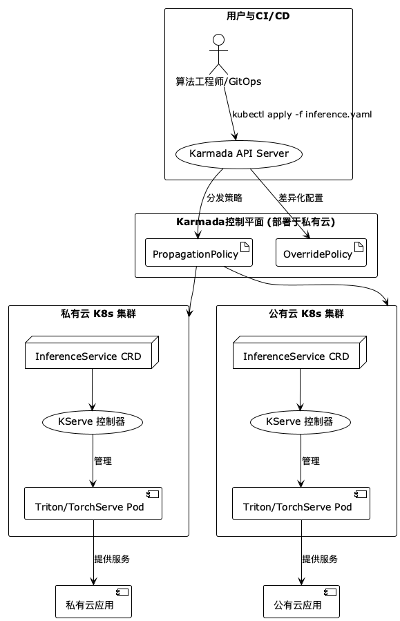

# **面向混合云的生产级机器学习推理平台架构演进方案**

---

### **1. 背景与战略目标**

当前，我们的机器学习平台已成功在私有云Kubernetes环境中孵化并稳定运行，为公司的算法团队提供了基础的模型训练与服务化能力，支撑了初期的业务需求。然而，随着业务规模的扩大和模型复杂度的提升，我们预见到平台在未来1-2年内将面临三大核心挑战：

1.  **成本压力（Cost Pressure）**：GPU资源成本高昂，在私有云中，大量非核心或低流量模型的静态资源分配导致了严重的资源浪费。
2.  **弹性瓶颈（Elasticity Bottleneck）**：私有云的资源容量有限，无法应对突发的大规模训练或推理需求（如大型营销活动、批量数据处理），限制了业务的想象空间。
3.  **稳定性与迭代效率（Stability & Velocity）**：缺乏标准化的、安全的模型发布流程（如Canary发布），使得模型迭代风险高、周期长。

为了应对这些挑战，并构建一个面向未来的、具备长期竞争力的AI基础设施，我们制定了向**混合云架构演进**的战略目标。其核心思想是：将私有云作为稳定核心，承载关键服务和日常研发；同时，充分利用公有云近乎无限的资源弹性与成本效益（尤其是Spot实例），来处理峰值负载和大规模计算任务。

本方案旨在为这一战略目标下的**模型推理服务**，设计一套清晰、健壮、可分阶段实施的技术架构，并重点考虑我们团队以**PyTorch为核心**的技术生态。

### **2. 推理服务的核心技术要求**

基于上述战略目标，未来的推理服务平台必须满足以下核心技术要求：

*   **极致的资源弹性与成本效益**：
    *   支持**Serverless**能力，能够根据实时流量自动扩缩容，尤其是**缩容到零（Scale-to-zero）**，以最大限度地节约GPU成本。
*   **高性能与高资源利用率**：
    *   提供低延迟、高吞吐的推理性能，并能通过**动态批处理（Dynamic Batching）**等技术，压榨GPU的利用率。
*   **生产级的稳定性与部署能力**：
    *   提供标准化的**Canary发布、A/B测试**和流量镜像能力，确保新模型上线的安全、平滑。
*   **卓越的开发者体验与运维效率**：
    *   为算法工程师提供框架原生（PyTorch）的、简洁统一的部署体验。
    *   平台应采用**声明式API（CRD）**进行管理，以无缝融入GitOps体系。
*   **无缝的混合云调度与管理**：
    *   具备跨多个Kubernetes集群（私有云、公有云）的**统一资源视图**和**智能调度能力**，能根据策略自动分发和管理推理服务。

### **3. 主流推理服务框架技术选型对比**

为了满足上述要求，我们对业界主流的推理服务框架进行了深入调研与对比。

| 特性/维度 | TorchServe | NVIDIA Triton | KServe |
| :--- | :--- | :--- | :--- |
| **定位** | **PyTorch原生服务器** | **高性能通用服务器** | **云原生服务平台 (控制平面)** |
| **核心优势** | 与PyTorch生态无缝集成，学习曲线平缓。 | **极致的GPU吞吐性能**（动态批处理），广泛的模型格式支持。 | **生产级运维能力**（Serverless, Canary发布, A/B测试），声明式API。 |
| **性能优化** | 支持基础的批处理。 | **动态批处理**、多模型实例并发、模型分析器。 | 依赖并编排底层服务器的性能。 |
| **部署模式** | 独立服务器进程/容器。 | 独立服务器进程/容器。 | **Kubernetes CRD**，本身不执行模型，而是管理底层服务器。 |
| **混合云能力** | 无 | 无 | 无，仅限于单集群管理。 |

**结论**：没有任何一个单一框架能满足我们所有的要求。TorchServe对开发者友好但运维能力弱；Triton性能强悍但缺乏部署流程管理；KServe提供了完美的云原生运维能力但需要一个底层推理服务器。因此，最佳方案必然是一个**分层组合的架构**。

### **4. 分阶段的架构落地与演进路线**

我们提出一个三阶段的演进路线，旨在以**风险最低、见效最快、天花板最高**的方式，逐步构建我们的最终架构。

#### **第一阶段：快速落地与流程验证（前3个月）**

*   **目标**：快速解决从0到1的问题，为算法团队建立一套标准化的模型服务化流程。
*   **技术选型**：在**私有云K8s集群**中，使用 **TorchServe** 作为推理服务器。
*   **实施要点**：
    1.  定义标准的Dockerfile，将TorchServe容器化。
    2.  制定`.mar`模型打包规范，让算法工程师可以自助打包模型。
    3.  通过标准的Kubernetes Deployment和Service来部署模型服务。
*   **预期成果**：算法团队能够独立、快速地将PyTorch模型部署为在线服务，验证业务逻辑。

#### **第二阶段：引入云原生能力，实现降本增效（3 - 9个月）**

*   **目标**：解决GPU成本浪费和模型发布风险的核心痛点。
*   **技术选型**：引入 **KServe** 作为推理服务的控制平面，并引入 **Karmada** 作为多集群管理的“联邦大脑”。
*   **实施要点**：
    1.  在私有云集群中部署KServe，并将其默认的`predictor`配置为我们已标准化的TorchServe容器。
    2.  引导算法工程师从编写Deployment YAML，转向编写KServe的`InferenceService` CRD。他们将立即获得**Serverless缩容到零**和**Canary发布**的能力。
    3.  在私有云中部署Karmada控制平面，并首先将**私有云K8s集群自身**作为一个成员集群（Member Cluster）纳管进来。这为未来的混合云扩展铺平了道路，且对现有业务无任何影响。
*   **预期成果**：GPU资源成本显著降低。模型发布流程标准化、自动化且风险可控。平台具备了统一的多集群管理入口。

#### **第三阶段：迈向混合云，追求极致性能（未来：9个月以后）**

*   **目标**：实现跨云的弹性伸缩，并获得业界顶级的推理性能。
*   **技术选型**：**Karmada + KServe + NVIDIA Triton**。
*   **实施要点**：
    1.  通过**Karmada**正式纳管一个或多个**公有云K8s集群**。利用Karmada的`Pull`模式，确保安全的网络连接。
    2.  由平台工程师定义`PropagationPolicy`（分发策略），实现智能的跨云调度。例如：将需要GPU Spot实例的批量推理任务自动调度到公有云。
    3.  定义`OverridePolicy`（差异化配置策略），自动处理不同云环境的配置差异（如存储类、节点亲和性等）。
    4.  在KServe层面，将数据平面逐步从TorchServe**无缝升级到NVIDIA Triton**，以获得其强大的动态批处理能力，最大化吞吐量和GPU利用率。
*   **预期成果**：建成一个功能强大、成本优化、具备高可用和云弹性的、业界领先的机器学习推理平台。

### **5. 最终架构蓝图**

### **6. 总结**

本方案提出的三阶段演进路线，是一个循序渐进、步步为营的策略。它能够在每个阶段都解决当前最迫切的业务问题，同时其架构设计具有高度的前瞻性和扩展性。通过将**Karmada的联邦调度能力**、**KServe的云原生运维能力**以及**Triton的极致推理性能**进行有机结合，我们将能够构建一个技术领先、成本可控、稳定可靠的混合云机器学习推理平台，为公司未来的AI业务发展提供坚实的数字底座。
