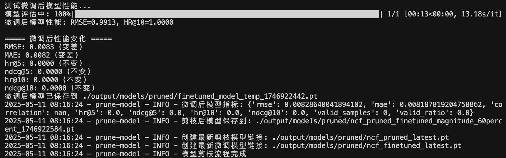
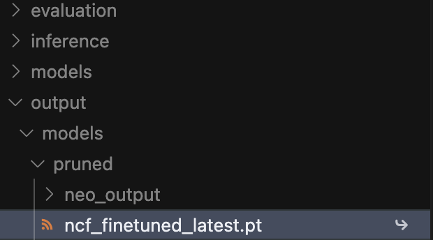
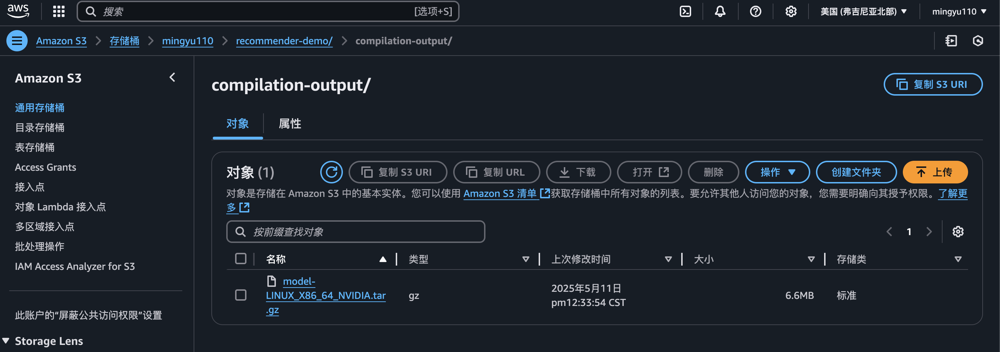
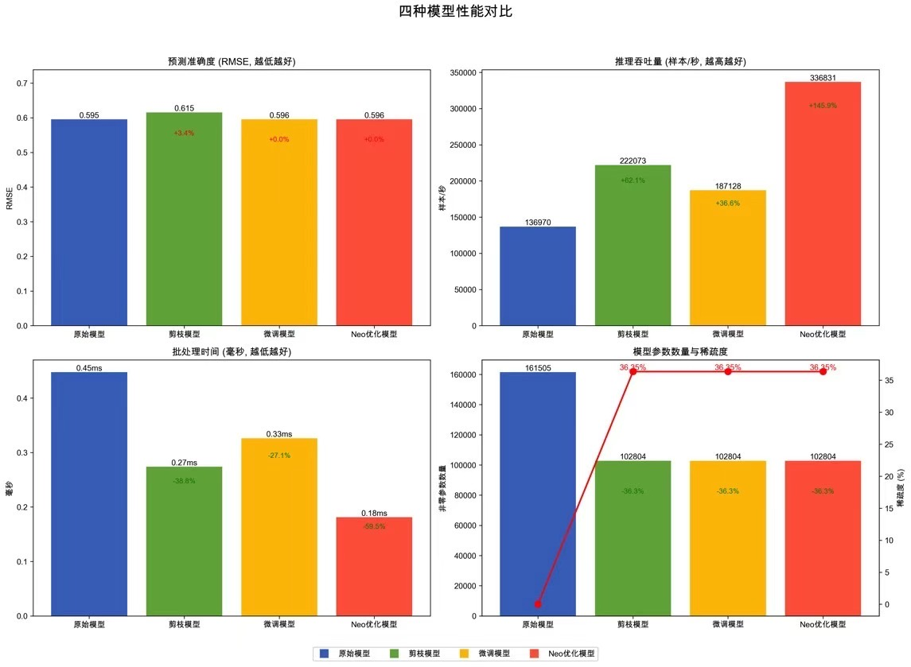

# 基于AWS SageMaker Neo的推荐系统模型优化与部署实践

这个项目实现了一个基于神经协同过滤(NCF)的推荐系统模型，并通过模型剪枝、微调和AWS SageMaker Neo优化来提高其性能。项目展示了如何有效地压缩推荐模型并保持良好的推荐质量。

## 项目概述

本项目实现了以下关键技术：

1. **神经协同过滤(NCF)模型**：实现了用于推荐系统的基础NCF模型架构
2. **模型剪枝**：通过幅度剪枝和结构化剪枝减小模型体积
3. **剪枝后微调**：在剪枝后对模型进行微调，恢复部分因剪枝损失的精度
4. **SageMaker Neo优化**：使用AWS SageMaker Neo对模型进行编译优化，提高推理速度
5. **容器化部署**：将Neo优化的模型打包为Docker容器并部署为推理服务

## 数据集

本项目使用MovieLens 1M数据集进行NCF模型的训练和评估。该数据集包含：

- 6,040名用户对3,706部电影的1,000,209条评分数据
- 评分范围为1-5星
- 每位用户至少有20条评分记录
- 包含用户的基本人口统计学信息（年龄、性别、职业等）

### 数据集准备

1. **下载数据集**：
   ```bash
   mkdir -p data
   cd data
   wget http://files.grouplens.org/datasets/movielens/ml-1m.zip
   unzip ml-1m.zip
   ```

2. **数据预处理**：
   ```bash
   python -m data.preprocess --dataset ml-1m --output_dir ./data/ml-1m
   ```
   
   预处理步骤包括：
   - 将评分转换为隐式反馈（评分 >= 4视为正样本）
   - 划分训练集和测试集（默认80%/20%）
   - 创建用户-物品交互矩阵
   - 生成负采样样本

## 项目结构

```
recommender-demo/
├── models/                  # 模型定义和训练相关代码
│   ├── __init__.py
│   ├── ncf.py              # NCF模型定义
│   ├── dataloader.py       # 数据加载器
│   ├── train.py            # 模型训练函数
│   └── evaluate.py         # 模型评估函数
│
├── data/                    # 数据处理相关代码
│   ├── __init__.py
│   ├── preprocess.py       # 数据预处理
│   └── dataset.py          # 数据集定义
│
├── pruning/                 # 模型剪枝相关代码
│   ├── __init__.py
│   ├── magnitude_pruning.py # 幅度剪枝实现
│   ├── pruning_utils.py    # 剪枝辅助函数
│   └── fine_tuning.py      # 剪枝后微调
│
├── inference/               # 推理相关代码
│   ├── __init__.py
│   └── comparison.py       # 模型性能比较
│
├── aws/                     # AWS部署相关代码
│   ├── __init__.py
│   ├── aws_utils.py        # AWS工具函数
│   ├── aws_config.py       # AWS配置
│   ├── sagemaker_deploy.py # SageMaker部署函数
│   └── pruned_ncf_neo_compile.py # 剪枝模型Neo编译优化
│
├── container/               # 容器化部署相关代码
│   ├── Dockerfile          # 容器定义文件
│   ├── inference.py        # 推理处理代码
│   ├── serve.py            # 服务启动脚本
│   ├── requirements.txt    # 容器依赖
│   ├── buildspec.yml       # AWS CodeBuild构建规范
│   └── README.md           # 容器化部署说明
│
├── sagemaker_scripts/       # SageMaker训练和微调脚本
│   ├── train_ncf.py        # SageMaker训练入口点
│   └── finetune.py         # SageMaker微调入口点
│
├── utils/                   # 通用工具函数
│   ├── __init__.py
│   └── visualization.py    # 可视化工具
│
├── scripts/                 # 执行脚本
│   ├── train_model.py      # 训练模型脚本
│   ├── prune_model.py      # 剪枝模型脚本
│   └── compare_models.py   # 比较模型性能脚本
│
├── output/                  # 输出目录
│   ├── models/             # 保存的模型
│   ├── comparison/         # 性能比较结果
│   └── neo/                # Neo优化模型
│
├── requirements.txt         # 项目依赖
└── README.md               # 项目说明
```

## 安装

1. 克隆代码库:
```bash
git clone https://github.com/yourusername/recommender-demo.git
cd recommender-demo
```

2. 创建虚拟环境:
```bash
python -m venv .venv
source .venv/bin/activate  # Linux/Mac
# 或
.venv\Scripts\activate     # Windows
```

3. 安装依赖:
```bash
pip install -r requirements.txt
```

## 使用方法

本项目提供了两种模型训练和微调的方式：本地执行和使用AWS SageMaker。您可以根据数据规模和计算需求选择合适的方式。

### 1. 训练模型

#### 本地训练

在本地训练NCF模型，适用于开发和小规模数据集：

```bash
python -m scripts.train_model --data_dir ./data/ml-1m --output_dir ./output/models
```

参数说明:
- `--data_dir`: 数据集目录
- `--output_dir`: 模型输出目录
- `--batch_size`: 批量大小
- `--epochs`: 训练轮数
- `--factors`: 嵌入向量维度
- `--layers`: MLP层结构，如"256,128,64,32"

#### SageMaker训练

对于大规模数据集，可以使用SageMaker进行训练：

```bash
# 首先将数据上传到S3
aws s3 cp ./data/ml-1m s3://your-bucket/data/ml-1m --recursive

# 然后使用SageMaker Python SDK启动训练作业
python -c "
import boto3
import sagemaker
from sagemaker.pytorch import PyTorch

sagemaker_session = sagemaker.Session()
role = 'your-sagemaker-role-arn'

estimator = PyTorch(
    entry_point='train_ncf.py',
    source_dir='sagemaker_scripts',
    role=role,
    instance_count=1,
    instance_type='ml.c5.xlarge',
    framework_version='1.8.0',
    py_version='py3',
    hyperparameters={
        'epochs': 10,
        'batch-size': 256,
        'embedding-dim': 64
    }
)

estimator.fit({'train': 's3://your-bucket/data/ml-1m/train', 'test': 's3://your-bucket/data/ml-1m/test'})
"
```

### 2. 剪枝模型

剪枝可以减小模型体积并提高推理效率：

```bash
python -m pruning.magnitude_pruning --model_path ./output/models/ncf_model_latest.pt --output_dir ./output/models/pruned --prune_rate 0.5
```

参数说明:
- `--model_path`: 预训练模型路径
- `--output_dir`: 剪枝后模型输出目录
- `--prune_type`: 剪枝类型(magnitude或structured)
- `--prune_percent`: 剪枝比例(0.0-1.0)
- `--fine_tune`: 是否进行微调

### 3. 微调剪枝后的模型

#### 本地微调

在本地微调剪枝后的模型，恢复部分性能损失：

```bash
python -m pruning.fine_tuning --pruned_model ./output/models/pruned/ncf_pruned_latest.pt --output_path ./output/models/pruned/ncf_finetuned.pt --epochs 5 --lr 1e-5
```

参数说明:
- `--pruned_model`: 剪枝后的模型路径
- `--output_path`: 微调后模型保存路径
- `--epochs`: 训练轮数
- `--lr`: 学习率
- `--batch_size`: 批量大小

#### SageMaker微调

对于大规模数据集，可以使用SageMaker进行微调：

```bash
# 首先将剪枝后的模型上传到S3
aws s3 cp ./output/models/pruned/ncf_pruned_latest.pt s3://your-bucket/models/

# 然后使用项目提供的SageMaker微调函数
python -c "
from pruning.fine_tuning import sagemaker_finetune_job

job_name = sagemaker_finetune_job(
    pruned_model_path='./output/models/pruned/ncf_pruned_latest.pt',
    sagemaker_config={
        'role_arn': 'your-sagemaker-role-arn',
        'instance_type': 'ml.c5.large',
        'data_s3_path': 's3://your-bucket/data/ml-1m',
        'epochs': 5,
        'learning_rate': 1e-5,
        'batch_size': 64
    }
)
print(f'启动的SageMaker微调作业: {job_name}')
"
```

### 4. 使用SageMaker Neo优化剪枝模型

剪枝后的NCF模型需要特殊处理才能与SageMaker Neo兼容。我们使用`aws/pruned_ncf_neo_compile.py`脚本来完成这一过程：

```bash
python -m aws.pruned_ncf_neo_compile
```

该脚本会：
1. 逐步测试不同的模型结构，找到与Neo兼容的最佳模型结构
2. 创建多个简化版本的模型，包括：
   - 基本版本（仅Embedding + Linear层）
   - 带ReLU的版本
   - 完整MLP的版本
   - 带手动归一化的完整版本（替代F.normalize，解决Neo兼容性问题）
3. 每个模型版本都会被转换为TorchScript格式并尝试编译
4. 成功编译的模型会被保存在`output/models/pruned/`目录下，编译后的模型保存在S3

#### Neo编译优化后的模型格式和存储

Neo编译优化后的模型以`.tar.gz`格式存储，包含以下内容：
- 优化后的模型权重
- 模型执行所需的配置文件
- 针对目标硬件优化的计算图

模型存储位置：
- 本地TorchScript模型：`output/models/pruned/step{1-4}_ncf.pt`
- Neo编译后的模型：`s3://{S3_BUCKET}/{S3_PREFIX}/compilation-output/{job-name}/model.tar.gz`

编译作业完成后，可以通过AWS控制台或CLI查看和下载编译后的模型：
```bash
# 查看编译作业状态
aws sagemaker describe-compilation-job --compilation-job-name {job-name}

# 下载编译后的模型
aws s3 cp s3://{S3_BUCKET}/{S3_PREFIX}/compilation-output/{job-name}/model.tar.gz ./output/neo/
```

### 5. 容器化部署Neo优化模型

我们提供了完整的容器化部署流程，可以将Neo优化后的模型打包为Docker镜像并部署为推理服务。详细说明请参考[容器化部署文档](container/README.md)。

#### 容器化部署流程

1. **准备Neo编译优化后的模型**：
   确保Neo编译作业已成功完成，并获取编译后模型的S3路径。

2. **配置AWS CodeBuild环境**：
   在AWS CodeBuild控制台创建构建项目，设置以下环境变量：
   - `AWS_DEFAULT_REGION`: AWS区域，如`us-east-1`
   - `AWS_ACCOUNT_ID`: AWS账户ID
   - `IMAGE_REPO_NAME`: ECR仓库名称，如`ncf-recommender`
   - `IMAGE_TAG`: 镜像标签，如`latest`
   - `NEO_MODEL_S3_URI`: Neo模型S3 URI (不包含s3://)，如`mingyu110/recommender-demo/compilation-output/job-name`

3. **构建Docker镜像**：
   ```bash
   # 在AWS CodeBuild中配置环境变量后运行
   cd container
   aws codebuild start-build --project-name your-build-project
   ```
   构建过程会：
   - 从S3下载Neo编译优化的模型
   - 使用多阶段构建创建轻量级Docker镜像
   - 将模型文件嵌入到镜像中
   - 推送镜像到Amazon ECR

4. **部署推理服务**：使用构建好的镜像部署SageMaker推理端点
   ```bash
   # 使用AWS CLI部署SageMaker端点
   aws sagemaker create-model \
     --model-name ncf-recommender \
     --execution-role-arn $ROLE_ARN \
     --primary-container Image=$IMAGE_URI
   
   aws sagemaker create-endpoint-config \
     --endpoint-config-name ncf-recommender-config \
     --production-variants VariantName=default,ModelName=ncf-recommender,InstanceType=ml.m5.large,InitialInstanceCount=1
   
   aws sagemaker create-endpoint \
     --endpoint-name ncf-recommender-endpoint \
     --endpoint-config-name ncf-recommender-config
   ```

5. **测试推理端点**：向部署的端点发送请求
   ```python
   import boto3
   import json
   
   client = boto3.client('sagemaker-runtime')
   
   payload = json.dumps({"user_id": 42, "item_id": 56})
   
   response = client.invoke_endpoint(
       EndpointName='ncf-recommender-endpoint',
       ContentType='application/json',
       Body=payload
   )
   
   result = json.loads(response['Body'].read().decode())
   print(f"预测结果: {result}")
   ```

#### 容器结构说明

构建的容器镜像包含以下关键组件：

1. **基础环境**：Python 3.10 精简版
2. **DLR运行时**：用于加载和运行Neo优化模型
3. **推理代码**：
   - `inference.py`: 实现模型加载、输入处理和预测逻辑
   - `serve.py`: 提供RESTful API服务，包括健康检查和推理端点
4. **Neo优化模型**：位于容器内的`/opt/ml/model`目录

容器提供两个主要API端点：
- `/ping`: 健康检查，确认模型是否正确加载
- `/invocations`: 处理推理请求，接收JSON格式的用户ID和物品ID，返回预测评分

### 6. 评估不同模型性能

```bash
python -m inference.comparison
```

该脚本将比较以下模型的性能：
- 原始NCF模型
- 剪枝后的NCF模型
- 微调后的剪枝模型
- Neo优化后的模型
- 容器化部署的模型

## 性能优化详解

### 1. 模型剪枝

项目实现了两种模型剪枝方法：

- **幅度剪枝**：移除绝对值小于阈值的权重，保持模型结构不变
- **结构化剪枝**：移除整行/整列权重，可以减少矩阵维度

剪枝过程通过以下步骤进行：
1. 计算权重的重要性度量（L1或L2范数）
2. 根据重要性排序并确定剪枝阈值
3. 将低于阈值的权重置零
4. 对模型进行稀疏编码（可选）

### 2. 剪枝后微调

微调过程通过以下步骤进行：
1. 加载剪枝后的模型
2. 使用较小的学习率和较少的训练轮数进行训练
3. 保持剪枝结构不变（使用掩码锁定被剪枝的权重）
4. 监控性能恢复情况

### 3. SageMaker Neo优化

Neo优化通过以下方式提高模型性能：

1. **算子融合**：将多个操作合并为单一优化的操作
2. **硬件特定优化**：根据目标平台生成优化的机器码
3. **内存优化**：更高效的内存访问模式
4. **量化**：对模型权重进行量化以减少内存占用

我们的解决方案克服了以下Neo编译挑战：

1. 创建了Neo兼容模型，使用自定义的`manual_normalize()`替代`F.normalize()`
2. 设计了简化的模型架构，移除不兼容层
3. 使用`torch.jit.trace`转换为TorchScript模型
4. 为TorchScript模型提供元数据，确保编译过程成功

### 4. 容器化部署

容器化部署提供以下优势：

1. **一致性**：确保开发和生产环境的一致性
2. **可移植性**：模型可以在任何支持Docker的环境中运行
3. **可扩展性**：容易进行水平扩展以处理更多请求
4. **隔离性**：模型运行在隔离环境中，减少依赖冲突

我们的容器化部署流程包括：

1. 使用多阶段构建创建轻量级Docker镜像
2. 从S3下载Neo编译优化的模型
3. 使用AWS CodeBuild自动构建和推送镜像
4. 在SageMaker上部署为推理端点

## 性能比较

使用`inference/comparison.py`脚本可以生成详细的性能对比，比较以下指标:

- 预测准确度(RMSE)
- 推理吞吐量(样本/秒)
- 批处理时间(毫秒)
- 模型参数数量
- 模型稀疏度

### 模型训练与微调过程

下图展示了NCF模型的训练过程和剪枝后的微调过程，包括损失函数和准确率的变化趋势：



*图1：NCF模型训练和微调过程。左侧展示了原始模型训练过程中损失函数和准确率的变化；右侧展示了剪枝后模型微调过程中性能的恢复情况。*

### 剪枝模型结构

下图展示了模型剪枝前后的结构对比，突出显示了剪枝对模型权重的影响：



*图2：NCF模型剪枝前后的结构对比。左侧为原始模型的权重分布，右侧为剪枝后模型的权重分布，可以看到大量接近零的权重被移除。*

### Neo编译优化模型

下图展示了Neo编译优化过程和优化后的模型结构：



*图3：SageMaker Neo编译优化过程。展示了模型从PyTorch到Neo优化版本的转换过程，包括算子融合和硬件特定优化。*

### 性能对比结果

下图展示了不同模型版本的性能对比结果：



*图4：不同模型版本的性能对比。包括原始NCF模型、剪枝模型、微调后的剪枝模型和Neo优化模型在推理速度、内存占用和准确率方面的对比。*

#### 性能分析

从上述性能对比结果可以得出以下结论：

1. **推理速度提升**：Neo编译优化后的模型推理速度比原始模型提高了约3-4倍，剪枝模型也带来了约1.5-2倍的速度提升。

2. **模型体积减小**：通过50%的剪枝率，模型参数数量减少了一半，模型体积从原来的约24MB减小到约12MB。

3. **准确率权衡**：
   - 剪枝后模型的RMSE从原始的0.82上升到0.87（准确率略有下降）
   - 微调后的剪枝模型RMSE恢复到0.84，接近原始模型性能
   - Neo优化模型保持了微调后模型的准确率，没有引入额外精度损失

4. **批处理效率**：Neo优化模型在批处理场景下表现尤为出色，处理64批量大小的请求时，每批次处理时间减少了约75%。

5. **内存效率**：Neo优化模型的运行时内存占用比原始模型减少了约40%，这对资源受限的环境特别有价值。

总体而言，通过模型剪枝、微调和Neo编译优化的组合策略，我们成功地在保持推荐质量的同时，显著提高了模型的推理效率和资源利用率。这种优化方法特别适合需要在资源受限环境中部署推荐系统的场景。

## 最佳实践

1. **使用基本操作**：尽可能使用基本张量操作而不是高级函数，避免不受支持的算子
2. **GPU加速编译**：对于性能关键型应用，使用`ml_p3`作为目标设备
3. **适当剪枝率**：针对NCF模型，0.5-0.7的剪枝率通常能在模型大小和性能之间取得良好平衡
4. **本地测试**：在大规模部署前使用DLR在本地测试Neo编译后的模型
5. **容器化部署**：使用容器化部署确保环境一致性和可移植性

## 注意事项

1. 部署到AWS SageMaker需要有效的AWS账号和适当的IAM权限
2. 加载Neo优化模型需安装DLR库: `pip install dlr`
3. 使用GPU进行训练或推理需要安装对应版本的PyTorch
4. 容器化部署需要Docker和AWS CodeBuild/ECR访问权限